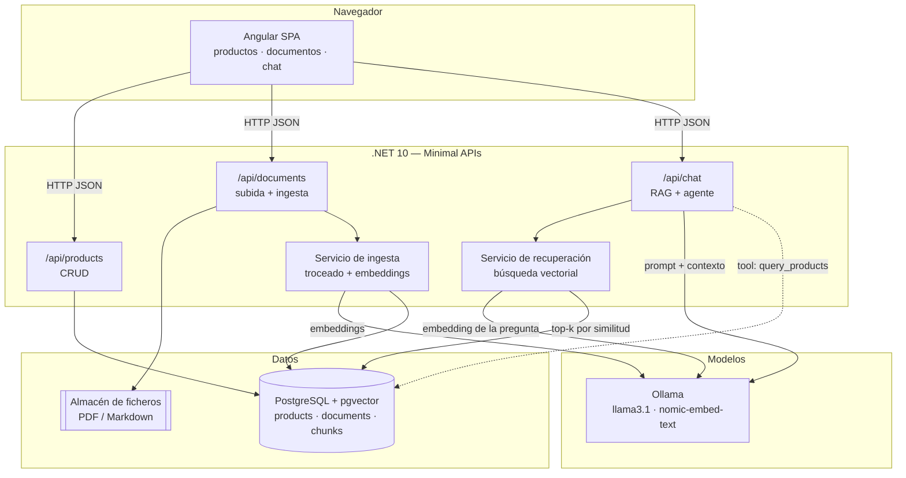

# Asistente de tienda de tecnología

Aplicación web para una tienda de tecnología que vende **móviles, ordenadores y
consolas**. Permite gestionar el catálogo de productos, subir documentos de la
tienda (manuales de producto y políticas generales: garantía, devoluciones,
envíos) y hacer preguntas en lenguaje natural. El asistente responde **usando
únicamente la documentación cargada** y cita el documento y el fragmento del que
ha sacado cada respuesta.

En el último paso el asistente se convierte en un **agente** con *tool calling*:
además de buscar en los documentos puede consultar la base de datos de productos
(por ejemplo, "¿qué móviles tenemos por debajo de 500 € con al menos 8 GB de RAM?").

> Proyecto de aprendizaje. Está construido paso a paso y cada paso tiene su
> propio documento explicativo en [`/docs`](#índice-de-documentación).

## Stack

| Capa | Tecnología |
|---|---|
| Frontend | Angular (standalone components, signals, formularios reactivos) |
| Backend | .NET 10, Minimal APIs agrupadas por funcionalidad |
| Datos | PostgreSQL + pgvector, EF Core con migraciones |
| IA | `Microsoft.Extensions.AI` (`IChatClient`, `IEmbeddingGenerator`) sobre Ollama en local |
| Tests | xUnit (unitarios + integración), Vitest/Karma en el frontend |
| DevOps | Docker Compose, GitHub Actions |

## Arquitectura



### Flujo de una pregunta (RAG)

1. El usuario escribe una pregunta en el chat.
2. El backend genera el **embedding** de la pregunta con Ollama.
3. Busca en `document_chunks` los fragmentos más cercanos por distancia coseno (pgvector).
4. Monta un *prompt* con esos fragmentos como contexto y unas reglas estrictas:
   responder solo con el contexto, admitir cuando no se sabe, citar las fuentes.
5. Devuelve la respuesta del LLM junto con la lista de citas.

## Arrancar el proyecto

### Requisitos

- [.NET 10 SDK](https://dotnet.microsoft.com/download)
- [Node.js 24 LTS](https://nodejs.org/) (Angular 22 exige 22.22+ o 24.15+)
- [Docker Desktop](https://www.docker.com/products/docker-desktop/)

### Puesta en marcha

```bash
# 1. Variables de entorno
cp .env.example .env

# 2. Infraestructura (Postgres + Ollama)
docker compose up -d

# 3. Descargar los modelos (solo la primera vez, tarda unos minutos)
pwsh ./infra/scripts/pull-models.ps1

# 4. Backend: herramientas, base de datos (migraciones + datos de ejemplo) y arranque
cd backend
dotnet tool restore
dotnet ef database update --project src/DocAssist.Api
dotnet run --project src/DocAssist.Api

# 5. Frontend (en otra terminal)
cd frontend && npm install && npm start
```

| Servicio | URL |
|---|---|
| Frontend | http://localhost:4200 |
| API | http://localhost:5080 |
| Salud de la API | http://localhost:5080/health · http://localhost:5080/health/ready |
| Documentación de la API | http://localhost:5080/scalar |
| PostgreSQL | `localhost:5433` |
| Ollama | http://localhost:11434 |

> El puerto del frontend se confirmará en el paso 5.

### Tests

```bash
cd backend && dotnet test
```

Los tests de integración levantan su propio PostgreSQL con
[Testcontainers](https://dotnet.testcontainers.org/), así que necesitan
**Docker arrancado**, pero no usan ni modifican la base de datos de desarrollo.

## Índice de documentación

Cada paso del proyecto tiene un documento en `/docs` que explica qué se hizo,
los conceptos nuevos (con su equivalente en Spring Boot o React), cómo probarlo
y las decisiones tomadas.

| # | Documento | Contenido |
|---|---|---|
| 00 | [Plan y progreso](docs/00-plan-y-progreso.md) | Los 12 pasos del proyecto con su estado |
| 01 | [Entorno y estructura del repositorio](docs/01-entorno-y-estructura.md) | Git, carpetas, Docker Compose, pgvector, Ollama |
| 02 | [Solución .NET y primera Minimal API](docs/02-solucion-dotnet-y-minimal-api.md) | Solución y proyectos, `Program.cs`, configuración, OpenAPI, health checks, xUnit |
| 02b | [Cambio de dominio: tienda de tecnología](docs/02b-cambio-de-dominio.md) | Paso al dominio de la tienda, datos estructurados frente a no estructurados, tipos anulables, migraciones en desarrollo y en producción |
| 03 | [EF Core, PostgreSQL y migraciones](docs/03-ef-core-y-migraciones.md) | `DbContext`, Fluent API, migraciones, *seed*, liveness y readiness |
| 04 | [CRUD de productos](docs/04-crud-de-productos.md) | Endpoints con `MapGroup`, DTOs, validación de .NET 10, ProblemDetails, logging estructurado, tests |
| 05 | [Frontend Angular y lista de productos](docs/05-frontend-angular-y-lista.md) | Standalone components, proxy de desarrollo, inyección de dependencias, `HttpClient` y Observables, signals, `@if`/`@for`, lazy loading, tests con `HttpTestingController` |
| 06 | [Formularios reactivos](docs/06-formularios-reactivos.md) | `FormGroup` tipado, `Validators` y validadores propios, errores accesibles, `input()` desde la ruta, borrado con confirmación, tests de componentes con `TestBed` |
| 07 | [Subida de documentos](docs/07-subida-de-documentos.md) | `multipart/form-data`, `IFormFile`, validación del contenido, almacenamiento en disco tras una interfaz, options pattern, relación uno a muchos opcional, `output()` y `viewChild` en Angular |
| 08 | [Ingesta y embeddings](docs/08-ingesta-y-embeddings.md) | Embeddings, troceado con solapamiento, pgvector e índice HNSW, `Microsoft.Extensions.AI` con Ollama, `BackgroundService` y `Channel`, 202 Accepted y polling |
| 09 | [Búsqueda semántica](docs/09-busqueda-semantica.md) | `POST /api/search`, distancia coseno con pgvector desde EF Core, similitud, limitaciones de los embeddings y búsqueda híbrida, tests con bolsa de palabras |
| 10 | [Chat con RAG y citas](docs/10-chat-con-rag.md) | RAG y grounding, diseño del prompt y sus reglas, citas verificables, `IChatClient`, streaming con Server-Sent Events, `fetch` + `ReadableStream` en Angular, pruebas con el modelo real |

## Revisión crítica del código generado con IA

El archivo [`AI_REVIEW.md`](AI_REVIEW.md) registra cada corrección aplicada al
código propuesto por el asistente: qué se generó, qué problema tenía y cómo se
arregló.
